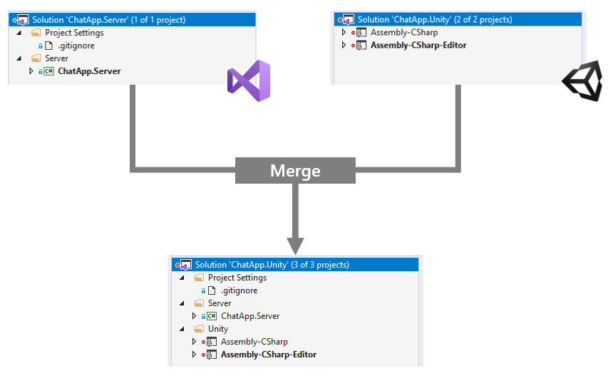

# SlnMerge

Unity でソリューションファイル生成時に指定したソリューションをマージするエディタ拡張です。

Unity とは別にサーバーサイドの C# プロジェクトおよびソリューションがあるようなケースで、Unity のソリューションで同時に開くことができるようになります。



## 動作確認環境
- Unity 2018.4.5f1 + Windows 10 & macOS 10.15
- Microsoft Visual Studio 2019
- JetBrains Rider 2019.2

## 使い方
### 1. SlnMerge をインストールする
#### 方法 1. Unity プロジェクトの `Assets/Editor` 配下に `src/Editor/SlnMerge.cs` をコピーする
リポジトリをクローンしてファイルをコピーします。

#### 方法 2. Package Manager からパッケージとして追加する
Unity 2019.1 以降のバージョンを利用している場合、Package Manager を使用して git リポジトリからパッケージをインストールできます。


```
https://github.com/Cysharp/SlnMerge.git?path=src
```

### 2. `プロジェクト名.sln.mergesettings` ファイルでマージしたいソリューションを指定する
Unity によって生成されるソリューションファイル名に .mergesettings をつけた名前の設定ファイルを用意します。

例えば MyUnityApp プロジェクトの場合は MyUnityApp.sln が生成されるので MyUnityApp.sln.mergesettings ファイルを作成します。

```xml
<SlnMergeSettings>
    <MergeTargetSolution>..\MyUnityApp.Server.sln</MergeTargetSolution>
</SlnMergeSettings>
```

**メモ:** ファイルが未指定の場合には `プロジェクト名.Merge.sln` が読み込まれます

## 設定
mergesettings ファイルには次の設定項目があります。

- `Disabled`: SlnMerge を無効にするかどうか (デフォルト: `false`)
- `MergeTargetSolution`: マージしたいソリューションのパス
- `NestedProjects`: ネストするプロジェクトを指定します。通常ソリューションフォルダーとして利用します
    - `NestedProject/FolderPath`: ソリューション上のフォルダーパス (存在しない場合は生成。GUIDと排他)
    - `NestedProject/FolderGuid`: ソリューション上のフォルダーのGUID (パスと排他)
    - `NestedProject/ProjectName`: プロジェクト名 (GUIDと排他)
        - ワイルドカードが使用可能です (`?`, `*`)
    - `NestedProject/ProjectGuid`: プロジェクトGUID (プロジェクト名と排他)
- `ProjectConflictResolution`: マージ元とマージ先でソリューション内に同名のプロジェクトがある場合の処理方法 (`PreserveAll`, `PreserveUnity`, `PreserveOverlay`)
    - `PreserveAll`: すべてのプロジェクトを残します (Unity とマージ対象のソリューションのプロジェクトの両方)
    - `PreserveUnity`: Unity が生成したソリューションのプロジェクトを残します (マージ対象のソリューションのプロジェクトを破棄)
    - `PreserveOverlay`: 上書きするソリューションのプロジェクトを残します (Unity が生成したソリューションのプロジェクトを破棄)

### ソリューションフォルダーに追加する
`NestedProjects` 設定を使用するとマージ後にプロジェクトをソリューションフォルダーへ移動できます。ベースのソリューションにソリューションフォルダーが存在しない場合には自動で追加しますが、ソリューションフォルダーの定義が設定ファイルに必要です。

```xml
<SlnMergeSettings>
    <MergeTargetSolution>..\ChatApp.Server.sln</MergeTargetSolution>
    <SolutionFolders>
        <!-- Unity という名前のソリューションフォルダーを GUID とともに定義する -->
        <SolutionFolder FolderPath="Unity" Guid="{55739033-89BA-48AE-B482-843AFD452468}">
    </SolutionFolder>
    <NestedProjects>
        <NestedProject ProjectName="Assembly-CSharp" FolderPath="Unity" />
        <NestedProject ProjectName="Assembly-CSharp-Editor" FolderPath="Unity" />
    </NestedProjects>
</SlnMergeSettings>
```

## トラブルシューティング
### 常にソリューションファイルが再生成され、Visual Studioに競合ダイアログが表示される
1. Unity Editor を閉じる
2. Unity Editor が生成した .csproj と .sln を削除する
3. プロジェクトを Unity Editor で開きなおす

マージ対象のプロジェクトと Unity が生成するソリューションで同名のプロジェクトが存在する場合、`ProjectConflictResolution` オプションを使用して3つの方法でコンフリクトを解決できます。

- すべてのプロジェクトを維持 (デフォルト)
- マージ対象のソリューションのプロジェクトを維持
- Unity が生成したソリューションのプロジェクトを維持

## ライセンス
MIT License
