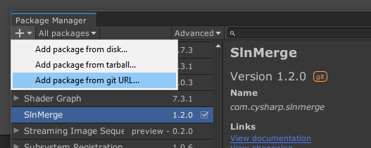

[](https://github.com/Cysharp/SlnMerge/actions) [](https://github.com/Cysharp/SlnMerge/releases)

# SlnMerge

SlnMerge merges the solutions when creating solution file by Unity Editor.

[日本語](README.ja.md)


<!-- START doctoc generated TOC please keep comment here to allow auto update -->
<!-- DON'T EDIT THIS SECTION, INSTEAD RE-RUN doctoc TO UPDATE -->
## Table of Contents

- [Works with](#works-with)
- [How to use](#how-to-use)
  - [1. Install SlnMerge](#1-install-slnmerge)
  - [2. Create `ProjectName.sln.mergesettings` and configure a target solution.](#2-create-projectnameslnmergesettings-and-configure-a-target-solution)
- [Settings](#settings)
  - [Add projects to solution folders](#add-projects-to-solution-folders)
- [Troubleshooting](#troubleshooting)
  - [Always regenerate the solution file, and Visual Studio displays a conflict dialog.](#always-regenerate-the-solution-file-and-visual-studio-displays-a-conflict-dialog)
- [License](#license)

<!-- END doctoc generated TOC please keep comment here to allow auto update -->

## Works with
- Unity 2022.3+
- Windows 11 and macOS 10.15
- Microsoft Visual Studio 2022/2026
- JetBrains Rider 2025.x

Both legacy solution format (.sln) and modern solution format (.slnx) are supported.

## How to use

### 1. Install SlnMerge
You can use Package Manager to install a package via git.



```
https://github.com/Cysharp/SlnMerge.git?path=src#{Version}
```

> [!NOTE]
> Please specify the release version like `2.0.0` for `{Version}`. If omitted, the main branch will be used, which may be unstable.

## Configure SlnMerge from Unity Editor

In the Unity Editor, select `Preferences` -> `SlnMerge` to open the settings panel. The settings items are saved as user settings for each project.


- **SlnMerge settings file**: Select the solution merge settings file (.mergesettings). By default, a file based on the solution name is automatically selected.
- **Processing Policy Override**: Override the solution processing policy. By default, the settings in the .mergesettings file are used.
- **Verbose Logging**: Enable verbose logging.
- **Edit current merge settings**: Open the currently selected merge settings file in the editor. If it does not exist, it will be created when editing.
- **Regenerate Solution file**: Regenerate the solution file.

You can configure detailed solution merge settings in the settings window opened by pressing the `Edit current merge settings` button.


The solution merge settings (.mergesettings) are shared across projects. For more information about the settings items, see [Solution Merge Settings](#solution-merge-settings).

## Configure SlnMerge by manually editing the .mergesettings file
In addition to the settings from the Unity Editor, you can also create and edit a `.mergesettings` file. Prepare a settings file with the same name as the solution file generated by Unity, but with the `.mergesettings` extension.

For example, when the project name is `MyUnityApp`, Unity Editor generates `MyUnityApp.sln`. You need to create `MyUnityApp.sln.mergesettings`.

> [!NOTE]
> If you are using `.slnx` format, please read `.sln` as `.slnx` below. If `.sln` is specified, `.slnx` is treated as a fallback target.

```xml
<SlnMergeSettings>
    <MergeTargetSolution>..\MyUnityApp.Server.sln</MergeTargetSolution>
</SlnMergeSettings>
```

You can specify the target solution to merge by `MergeTargetSolution` element.

> [!NOTE]
> If the `MergeTargetSolution` element does not exist or its content is empty, it will implicitly merge with an empty solution. This is useful when you only want to use the folder organization feature.

## Solution Merge Settings

The mergesettings file has the following settings:

- `MergeTargetSolution`: Path of the solution you want to merge
- `NestedProjects`: Specify the projects to nest. Usually used as a solution folder
    - `NestedProject/FolderPath`: Folder path on solution (created if it doesn't exist)
    - `NestedProject/ProjectName`: Project name
        - Wildcard is available (`?`, `*`)
- `ProjectConflictResolution`: Processing strategy when a solution contains a project with the same name (`PreserveAll`, `PreserveUnity`, `PreserveOverlay`) (default: `PreserveUnity`)
    - `PreserveAll`: Preserve all projects (both Unity generated projects and original projects)
    - `PreserveUnity`: Preserve Unity generated projects. (discard original project in a overlay solution)
    - `PreserveOverlay`: Preserve original projects in a overlay solution. (discard Unity generated projects from a merged solution)
- `DefaultProcessingPolicy`: Default processing policy for the solution (default: `Merge`)
    - `Merge`: Perform merge processing (default)
    - `NestedProjectOnly`: Perform nesting processing only for project solution folders
    - `Disabled`: Skip merge processing

### Add projects to solution folders
You can use `NestedProjects` settings to move projects to solution folders.
When a solution folder doesn't exist, SlnMerge will add the solution folder to the solution automatically.

```xml
<SlnMergeSettings>
    <MergeTargetSolution>..\ChatApp.Server.sln</MergeTargetSolution>
    <NestedProjects>
        <NestedProject ProjectName="Assembly-CSharp" FolderPath="Unity" />
        <NestedProject ProjectName="Assembly-CSharp-Editor" FolderPath="Unity" />
    </NestedProjects>
</SlnMergeSettings>
```

## Troubleshooting
### Always regenerate the solution file, and Visual Studio displays a conflict dialog.
1. Close Unity Editor.
2. Delete .csproj and .sln are generated by Unity Editor.
3. Reopen the project in Unity Editor

If a merge target solution has a project with the same name in the Unity generated solution, you can use use `ProjectConflictResolution` option to fix the conflict in a 3-way.

1. Preserve all projects
2. Preserve the project in the merge target solution
3. Preserve the project in the Unity generated solution (by default)

## License
MIT License

```
Copyright (c) 2019 Cysharp, Inc.

Permission is hereby granted, free of charge, to any person obtaining a copy
of this software and associated documentation files (the "Software"), to deal
in the Software without restriction, including without limitation the rights
to use, copy, modify, merge, publish, distribute, sublicense, and/or sell
copies of the Software, and to permit persons to whom the Software is
furnished to do so, subject to the following conditions:

The above copyright notice and this permission notice shall be included in all
copies or substantial portions of the Software.

THE SOFTWARE IS PROVIDED "AS IS", WITHOUT WARRANTY OF ANY KIND, EXPRESS OR
IMPLIED, INCLUDING BUT NOT LIMITED TO THE WARRANTIES OF MERCHANTABILITY,
FITNESS FOR A PARTICULAR PURPOSE AND NONINFRINGEMENT. IN NO EVENT SHALL THE
AUTHORS OR COPYRIGHT HOLDERS BE LIABLE FOR ANY CLAIM, DAMAGES OR OTHER
LIABILITY, WHETHER IN AN ACTION OF CONTRACT, TORT OR OTHERWISE, ARISING FROM,
OUT OF OR IN CONNECTION WITH THE SOFTWARE OR THE USE OR OTHER DEALINGS IN THE
SOFTWARE.

This library includes code derived from the following open source libraries.

================================================================================
Microsoft.VisualStudio.SolutionPersistence
https://github.com/microsoft/vs-solutionpersistence
================================================================================
The MIT License (MIT)

Copyright (c) Microsoft Corporation

Permission is hereby granted, free of charge, to any person obtaining a copy
of this software and associated documentation files (the "Software"), to deal
in the Software without restriction, including without limitation the rights
to use, copy, modify, merge, publish, distribute, sublicense, and/or sell
copies of the Software, and to permit persons to whom the Software is
furnished to do so, subject to the following conditions:

The above copyright notice and this permission notice shall be included in all
copies or substantial portions of the Software.

THE SOFTWARE IS PROVIDED "AS IS", WITHOUT WARRANTY OF ANY KIND, EXPRESS OR
IMPLIED, INCLUDING BUT NOT LIMITED TO THE WARRANTIES OF MERCHANTABILITY,
FITNESS FOR A PARTICULAR PURPOSE AND NONINFRINGEMENT. IN NO EVENT SHALL THE
AUTHORS OR COPYRIGHT HOLDERS BE LIABLE FOR ANY CLAIM, DAMAGES OR OTHER
LIABILITY, WHETHER IN AN ACTION OF CONTRACT, TORT OR OTHERWISE, ARISING FROM,
OUT OF OR IN CONNECTION WITH THE SOFTWARE OR THE USE OR OTHER DEALINGS IN THE
SOFTWARE.
```
