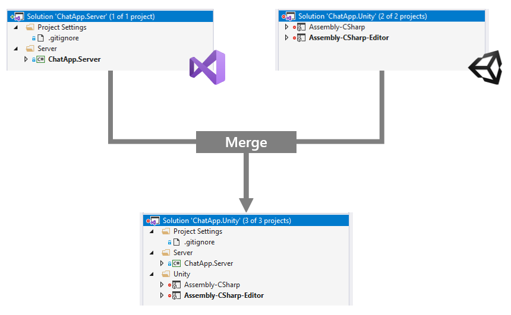

# SlnMerge

SlnMerge merges the solutions when creating solution file by Unity Editor.

[日本語](README.ja.md)



## Works with
- Unity 2018.4.5f1 + Windows 10 and macOS 10.15
- Microsoft Visual Studio 2019
- JetBrains Rider 2019.2

## How to use
### 1. Copy `src/SlnMerge.cs` to `Assets/Editor` in your Unity project.

### 2. Create `ProjectName.sln.mergesettings` and configure a target solution.
Create a setting XML file named `<ProjectName>.sln.mergesettings`.

For example, when the project name is `MyUnityApp`, Unity Editor generates `MyUnityApp.sln`. You need to create `MyUnityApp.sln.mergesettings`.

```xml
<SlnMergeSettings>
    <MergeTargetSolution>..\MyUnityApp.Server.sln</MergeTargetSolution>
</SlnMergeSettings>
```

You can specify the target solution to merge by `MergeTargetSolution` element.

**NOTE:** If you don't have the settings, SlnMerge uses `ProjectName.Merge.sln` as a target.

## Settings

The mergesettings file has the following settings:

- `Disabled`: Disable SlnMerge (default:` false`)
- `MergeTargetSolution`: Path of the solution you want to merge
- `NestedProjects`: Specify the projects to nest. Usually used as a solution folder
    - `NestedProject/FolderPath`: Folder path on solution (created if it doesn't exist; mutally exclusive with FolderGuid)
    - `NestedProject/FolderGuid`: GUID of folder on solution (mutally exclusive with FolderPath)
    - `NestedProject/ProjectName`: Project name (mutally exclusive with ProjectGuid)
    - `NestedProject/ProjectGuid`: Project GUID (mutally exclusive with ProjectName)
- `ProjectConflictResolution`: Processing strategy when a solution contains a project with the same name (`PreserveAll`, `PreserveUnity`, `PreserveOverlay`)
    - `PreserveAll`: Preserve all projects (both Unity generated projects and original projects)
    - `PreserveUnity`: Preserve Unity generated projects. (discard original project in a overlay solution)
    - `PreserveOverlay`: Preserve original projects in a overlay solution. (discard Unity generated projects from a merged solution)

### Add projects to solution folders
You can use `NestedProjects` settings to move projects to solution folders.
When a solution folder doesn't exist, SlnMerge will add the solution folder to the solution automatically. But, you need to define a solution folder as `SolutionFolder` in mergesettings.

```xml
<SlnMergeSettings>
    <MergeTargetSolution>..\ChatApp.Server.sln</MergeTargetSolution>
    <SolutionFolders>
        <!-- Define a solution folder named 'Unity' with GUID -->
        <SolutionFolder FolderPath="Unity" Guid="{55739033-89BA-48AE-B482-843AFD452468}">
    </SolutionFolder>
    <NestedProjects>
        <NestedProject ProjectName="Assembly-CSharp" FolderPath="Unity" />
        <NestedProject ProjectName="Assembly-CSharp-Editor" FolderPath="Unity" />
    </NestedProjects>
</SlnMergeSettings>
```

## Troubleshooting
### Always regenerate the solution file, and Visual Studio displays a conflict dialog.
1. Close Unity Editor.
2. Delete .csproj and .sln are generated by Unity Editor.
3. Reopen the project in Unity Editor

If a merge target solution has a project with the same name in the Unity generated solution, you can use use `ProjectConflictResolution` option to fix the conflict in a 3-way.

1. Preserve all projects (by default)
2. Preserve the project in the merge target solution
3. Preserve the project in the Unity generated solution

## License
MIT License
